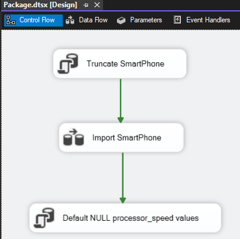
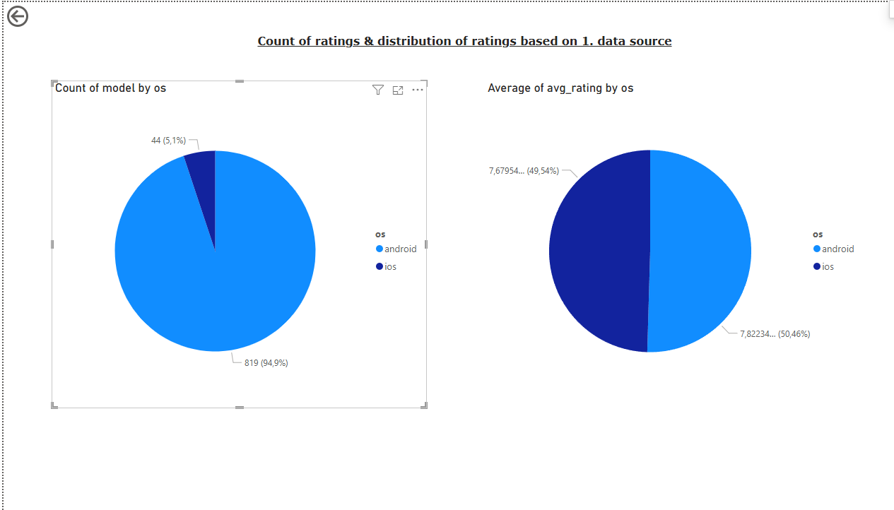

# BI NHF (WUPA9P)

A projekt célja az Android és iOS operációs rendszerű mobiltelefonok összehasonlítása. Kettő különböző adatforrás alapján próbál különbségeket keresni a két operációs rendszer között. 

A projekt MSSQL adatbázis szervert használ az adatok tárolásáért, mint data warehouse. Az ETL
folyamatokat az Integration Service (SSIS) segítségével kerültek megvalósításra. A reportok készítését PowerBI asztali alkalmazás biztosítja. Az adatelemzés Google Colab Notebook-on valósult meg Pandas és Jupyter könyvtárak segítségével. 

A házi feladat során készített **videó** ezen a [linken](https://drive.google.com/file/d/1ai7xZMhqhXgixLy11fse1ST5dnzJ2jsf/view?usp=sharing) található.

A következő bekezdésekben a pontozásnak megfelelően dokumentálom a házi feladat elkészítése során elvégzett feladatokat.

## ETL

Kétféle adatforrásból dolgozok.

- [Első adatforrás](https://www.kaggle.com/datasets/muzammilbaloch/smartphone-dataset)
- [Második adatforrás](https://www.kaggle.com/datasets/alanjo/android-vs-ios-devices-crossplatform-benchmarks)

### Első adatforrás

#### Adatforrásokból való betöltése célterületre

Az első adatforrás különböző operációs rendszerű telefonok listáját tartalmazza. Az adatforrás számos metrikával rendelkezik, mindegyike nem kerül tárolásra azonban. A tárolásra került adatokat a következő kép mutatja, mely tartalmazza a tábla létrehozásához szükséges sql parancsot.

Az adatforrás a következő típusú adatokat tartalmazza általánosságban, melyek a következő típusokban kerülnek tárolásra:
- szöveges --> NVARCHAR
- egész szám --> INT
- valós szám --> DECIMAL
- logikai érték --> BIT

Elsődleges kulcsot nem tartalmaz az adatforrás, így az device_id néven, valamint adatbázis szinten jön létre minden egyes új adat beszúrásakor a táblába.

#### Transzformáció és ütemezés

A transzformáció három fő lépésból áll, melyet a következő kép is demonstrál.

1. SmartPhone tábla megtisztítása
2. Adatok betöltése a táblába
3. A betöltésre került bizonyos adatok módosítása

Az **első lépés** törli a korábbi adatokat a SmartPhone táblából minden egyes importálás előtt, így garantálva, hogy az adatok naprakészek legyenek. A művelet *Execute SQL Task* komponensben kerül végrehajtásra.

A **második lépés** feldolgozza, átalakítja a .csv fájlból érkező adatokat annak megfelelően, hogy azok probléma nélkül a dwh-ba tárolásra kerüljenek. Ezt egy *Data Flow Task* komponensben kerül megvalósításra. (Erről részletesen később.)

A **harmadik lépés** kicseréli bizonyos (processor_speed oszlopban található) NULL típusú adatok egy alapértelmezett értékre. Ez az alapértelmezett érték *0.00*. Fontos, hogy csak akkor kerül beállításra, ha az *avg_rating* viszont nem NULL típusú. Ez a művelet szintén *Execute SQL Task* komponensben kerül végrehajtásra.

##### Transzformáció második lépése bővebben

Elsősorban *Conditional Split* komponens segítségével kiszűröm a kizárólag iOS vagy Android operációs rendszerrel rendelkező telefonokat. Mivel nincs szükségünk a más típusúakra, így ezek nem is kerülnek tárolásra.

A szöveges, egész szám és logikai érték típusú adatok betöltése során nincs külön átalakításra szükség. Sajnos a valós számokkal már más a helyzet. A valós számok a .csv fájlban tizedes vessző helyett tizedes ponttal kerültek tárolásra, vagyis konvertálásuk nehezített.

Ennek oka, hogy a *Flat File Source* komponens és az MSSQL adatbázis szerver is valós számok konvertálása esetén tizedes vesszőt vár el. Természetesen ennek fő oka a régió és nyelv jelenlegi beállítása, mely Magyarország (magyar).

Így a valós számok tizedes pontját *Derived Column* komponensben tizedes vesszőre cserélem, illetve, ha nem NULL érték, akkor konvertálásra is kerülnek. A *Data Flow*-t a következő kép mutatja. 

Az *avg_rating* és *processor_speed* valós számok külön kerülnek feldolgozásra.
- Amennyiben egy telefonhoz nem tartozik értékelés, úgy a telefonhoz tartozó többi adatot is NULL-ként kezelem, és tárolom el az adatbázisban.
- Amennyiben egy telefonhoz tartozik értékelés, de nem tartozik processzor sebesség, úgy a telefonhoz tartozó többi adat még tárolásra kerül, viszont a processzor sebesség NULL értéket kap. Egy későbbi szakaszban pedig minden ilyen helyzetben lévő telefon - értékelés van, de sebesség nincs - alapértelmezett értéket kap sebességét illetően.

Ezt követően a telefonok *model*-je alapján eltávolítom a duplikált elemeket, illetve rendezem e szerint egy *Sort* komponensben.

Végül az adatok tárolásra kerülnek *ADO NET Destination* komponensben.

### Második adatforrás

#### Adatforrásokból való betöltése célterületre

A második adatforrás kizárólag iOS és Android operációs rendszerű telefonokat tartalmaz. Mindegyik telefon négy egyedi értékelés mentén tartalmaz egy összpontszámot, illetve egy ötödik, mely az előzőeket összegzi. Az értékeléseket felhasználók adták.

Az adatforrás az előző adatforráshoz hasonlóan tárol szöveges, egész szám típusú adatokat. Szerencsére itt nincs valós szám típusú, így automatikus konverzióval mindegyik típusú adat könnyedén betölthető az mssql adatbázisba.

#### Transzformáció és ütemezés

A transzformáció csak kettő fő lépésből áll, melyet a következő kép is demonstrál.

1. Score tábla megtisztítása
2. Adatok betöltése a táblába

Az **első lépés** törli a korábbi adatokat a Score táblából minden egyes importálás előtt, így garantálva, hogy az adatok naprakészek legyenek. A művelet *Execute SQL Task* komponensben kerül végrehajtásra.

A **második lépés** feldolgozza, átalakítja a .csv fájlból érkező adatokat annak megfelelően, hogy azok probléma nélkül a dwh-ba tárolásra kerüljenek. Ezt egy *Data Flow Task* komponensben kerül megvalósításra. Ennek részleteit a következő kép mutatja be.

Az előző adatforráshoz hasonlóan történik az adatok importálása is a dwh-ba, azzal a különbséggel, hogy a .csv kiterjesztésű fájl minden adatot tartalmaz, nincs bennük üres/hiányzó érték. Így nincs szükség külön átalakításra egyik adatot se illetően.

## Report

Alább láthatók az egyes reportok kifejtve.

### 1. report

Az első report bemutatja az android és iOS telefonokat ár-érték arányban. Dinamizmusa, hogy az adatokat lehet rendezni modell, átlagos értékelés és ár szerint is növekvő vagy csökkenő sorrendben. Amennyiben csak az egyik operációs rendszerre vagyunk kíváncsiak, úgy leszúrás segítségével ez szintén beállítható.

### 2. report

A második report az értékelések alapján listázza a legjobb tíz és legrosszabb tíz mobiltelefont. Dinamizumusa, hogy az adatokat szintén az egyes metrikák, tulajdonságok alapján lehet rendezni. Leszúrás segítségével pedig szabályozható, hogy éppen melyik operációs rendszerrel rendelkező telefonok adatai kerüljenek megjelenítésre.

### 3. report

A harmadik report megjeleníti az összesített pontszám alapján a legjobb tíz android operációs rendszerrel rendelkező mobiltelefonokat. Mivel ezen adatok a Score táblából jönnek, mely nem tartalmaz jelenleg külön operációs rendszert meghatározó mezőt (oszlopot), így a *Device* oszlop szűrési feltételében megadtam, hogy csak azon telefonok kerüljenek listázásra, amelyek nem tartalmaznak iPad vagy iPhone szórészletet teljes nevükben.

### 4. report

A negyedik report az előzőhez hasonlóan jeleníti meg a legjobb tíz iOS mobiltelefont.

### 5. report

Az ötödik report bemutatja az első adatforrás alapján a leadott értékelések és operációs rendszerek közötti eloszlást. Az látszik, hogy míg Android operációs rendszerre jóval több szavazatot adtak le, addig a telefonok értékelése során kizárólag egy picivel tud felül kerekedni az iOS típusú telefonokon. Az Android telefonok egy átlagos 7,8-as, míg az iOS telefonok egy átlagos 7,7-es értékelést könyvelhetnek el maguknak (kerekítés után).

### 6. report

Végül a hatodik report megjeleníti a két operációs rendszerrel rendelkező eszközök eloszlását egy ár és érték koordináta rendszerben az első adatforrás alapján. Megfigyelhető, hogy 1-2 kivétellel, de az Android telefonok általánosságban olcsóbbak, mint az iOS eszközök legalább ugyanolyan jó, sőt jobb értékelést is el tudnak érni. 

## Adatelemzés

Az adatelemzés a specifikációtól eltér, hiszen az első adatforrás helyett egy olyan harmadik adatforrást használ, amely tartalmazza az egyes eszközök megjelenésének **pontos dátumát**. Továbbá megpróbálja az adatok alapján előre jelezni a következő kiadott telefonok metrikáit. Mivel az adatforrás kevés iOS eszközt tartalmaz korrekt adatokkal, így külön iOS eszközök predikciót nem tudtam elkészíteni.
- [Harmadik adatforrás](https://www.kaggle.com/datasets/pranav941/evolution-of-smartphones)

Az adatelemzéshez tartozó kód [ezen a linken](https://colab.research.google.com/drive/18hWpT5wx2IJPFPH0FqA0WPpC0zI8hGw0?usp=sharing) található meg.

Általánosságban a következő beállítások alapján készültek az adatelemzések:

- 1 éves távlat
    - training set: 2018
    - validation set: 2021
    - test set: 2022
- 4 éves távlat
    - training set: 2011
    - validation set: 2017
    - test set: 2018

### Akkumulátor

Készítettem kizárólag az android eszközök akkumulátor élettartamáról egy idősoros előrejelzést. Itt sajnos bizonyos kiugró értékek eléggé megnehezítették egy konzisztensen növekvő fejlődés képét. A valós adatokon jól látszódik, hogy egy négy éves távlatban folyamatosan fejlődik valamennyit átlagosan, ugyanakkor nem annyira, mint azt a predikció mutatja.

Ugyanakkor, ha a megjósolandó évek számát csökkentjük, és sokkal közelibb adatokkal dolgozunk, akkor valamennyivel jobb predikciót kaphatunk. Ekkor a veszteségek is sokkal kevesebbek.

Itt a jól látható kiugró értékeken kívül általánosságban elmondható, hogy a predikció jó, sőt a 2022-05-ös időszakban szinte betrafálja.

### RAM

Nézzük, hogyan alakul android, majd bármely operációs rendszerrel rendelkező telefon esetén a RAM predikciója.

#### Android

Az első képen egy év predikcióját, míg a másodikon négy év predikcióját vizsgáltam. Az első képen a kiugró értékek szintén bezavarhatnak, ugyanakkor az év elején és közepén sikerül pontosan becsülnie. A második képen viszont 2019-től a valódi mennyisége egy RAM-nak egy telefon legalább kétszeresére nő, azonban ezt a predikció 2021-től kevesebbnek jósolja, ami hibás predikcióhoz vezet. Itt a training set 2011-től, a validation set 2017-től indult.

#### All OS

Érdekes módon, ha a training és validation set az előzőekhez hasonlóan kerül beállításra és négy év távlatát vizsgáljuk, akkor sokkal szebb és pontosabb predikciót kapunk, egy nagyon nagy kiugró becslést leszámítva.

### Belső tárhely

Nézzük, hogyan alakul bármely operációs rendszerrel rendelkező telefon, majd android esetén a belső tárhely predikciója.

#### All OS

Ha minden beállítást megismétlünk a RAM-hoz hasonlóan, akkor éppen ellenkezőleg egy rosszabb becslési képet kapunk. A belső tárhely ugyanis sokkal gyorsabb fejlődésen ment keresztül, mint az akkumulátor vagy a RAM.

Vagyis, ha kisebb távlatban vizsgáljuk a fejlődést, akkor sokkal szebb, de még mindig nem a legpontosabb képet fogjuk sajnos kapni.

#### Android

Csak android típusú telefonok esetén így szintén egy éves távlatra jósolva kapunk valamennyivel szebb képet, mintha 4 éves távlatra vizsgálnák több régebbi adat alapján.

